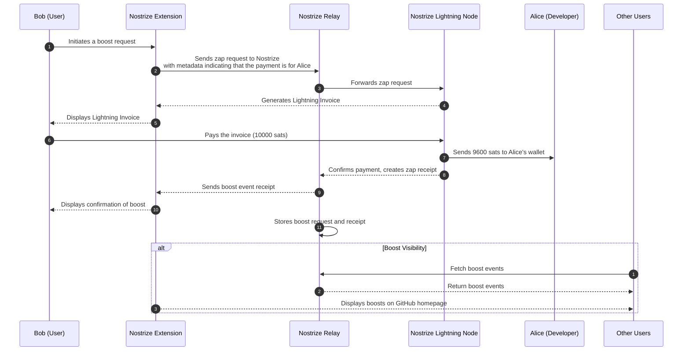

# Nostrize Browser Extension (Work In Progress)

Welcome to Nostrize - the browser extension that empowers any website with the [Nostr](https://github.com/nostr-protocol/nostr) experience. Nostrize seamlessly integrates tipping and crowdsourcing capabilities through Bitcoin, making every interaction permissionless. Join us in a world where supporting content and collaborative projects is effortless. Elevate your browsing with the power of Nostr and Bitcoin, and become part of the [Value4Value](https://value4value.info/) movement today.

# Presentation

https://slides.com/nostrize/code/fullscreen

# Demo video

https://github.com/user-attachments/assets/a12b9fa1-e351-462c-b706-d186040ffc6e

# Projects

## X/Twitter

* Do you still need to use X/Twitter because everyone is still there?
* Good news: you can use nostr via Nostrize on X/Twitter now! 🤯
* Add your npub or nip05 to your account bio and you are ready to receive zaps

## Youtube

* Easy integration via channel description by adding your npub or nip05 (see our [youtube channel](https://www.youtube.com/@Nostrize) for reference)
* Receive donations in your videos or shorts
* m.youtube.com support
* And more features are coming...

## GitHub

The first platform that you could use Nostrize was GitHub. It was chosen as the initial focus because we wanted to fund future Nostrize development using Nostrize itself!

With Nostrize on GitHub, you can:

* Seamlessly connect your Nostr and GitHub accounts with a [simple step](https://github.com/nostrize/github-connect) – no waiting list required.
* Support any user or organization through donations.
  * Receive tips directly without any commission or fees.
* Fund issues to incentivize solutions. (coming soon)
  * Earn payments for your pull requests that address and resolve issues.
* And more features are coming...

### Nostrize Booster

Nostrize Booster is designed for GitHub and may be added for other platforms later.

Nostrize users can make a boost to a github user, organization or a repository for endorsement, to a PR for visibility that more people can see and review it, or to a github issue for again for visibility hoping people would see and share a workaround or fix it. 

## Telegram Web (web.telegram.org)

The latest integration of Nostrize. Add your npub to your bio and you're ready to go!

If you're a telegram user, please join our group: https://t.me/+3ZIAq1yCcyJlMWUy

# How to install

* You can only install the development version right now
* Go to [releases page](https://github.com/nostrize/extension/releases) in nostrize extension github
* Download the latest release.zip
* Extract zip file in your file system

# Installing Nostrize as an Unpacked Extension in Chrome

To test or use your build locally in Chrome, follow these steps to install it as an unpacked extension:

1. Navigate to [chrome://extensions/](chrome://extensions/) in the address bar.
1. Enable "Developer mode" by toggling the switch in the top-right corner.
1. Load the Unpacked Extension:

Click the "Load unpacked" button that appears after enabling Developer mode.

* if you downloaded the release.zip, find the extracted folder
* if you are [building](https://github.com/nostrize/extension?tab=readme-ov-file#build-nostrize-browser-extension), navigate to the **dist** directory within your Nostrize project directory.

# Verify Installation

Ensure Nostrize appears in your list of extensions and is enabled. You can pin the extension to see it all the time.

# How to build

## Dependencies

* We depend on [nvm](https://github.com/nvm-sh/nvm?tab=readme-ov-file#about) for nodejs versioning. 
* You can manually install the required nodejs version by looking our [.nvmrc](https://github.com/nostrize/extension/blob/main/.nvmrc) file

## Build Nostrize Browser Extension 

1. Create a directory: `mkdir nostrize`
1. Clone the repo ex: `git clone https://github.com/nostrize/extension.git`
1. Go to the directory: `cd extension`
1. `nvm install` if you have nvm to install the required nodejs instance.
1. `npm install` to install nodejs dependencies
1. `npm run build` to run the build.sh script

Note for Windows Users: The build.sh script is a bash script and may require additional tools like Git Bash, Cygwin, or WSL (Windows Subsystem for Linux) to run on Windows. Alternatively, consider translating the bash script logic into an equivalent build.bat script or using npm scripts directly for cross-platform compatibility.

After build, a **dist** directory should be created in the root.

## Testing and Usage

Visit a supported website or one of the test pages to see Nostrize in action.
If you make changes to the extension, return to [chrome://extensions/](chrome://extensions/), find Nostrize, and click the "Reload" button to apply your updates.
